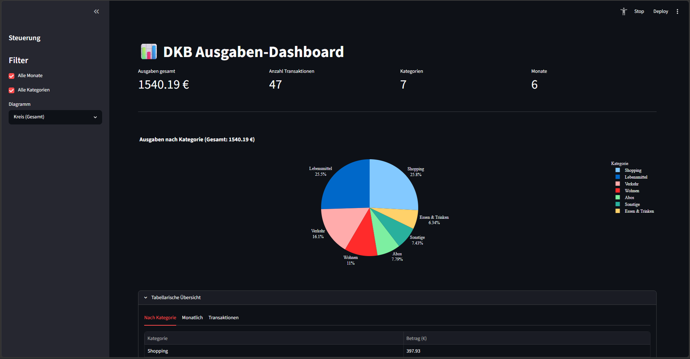

<div align="center">

# DasKannBank-Graphen

**Ausgabenvisualisierung für DKB-Kontoauszüge — Desktop App (Tauri + Rust + React)**


[](https://github.com/OsokaOiv/DasKannBank-Graphen/actions/workflows/ci.yml)
[](https://www.rust-lang.org)
[](LICENSE)
[](docs/usage.md)
[](desktop/src-tauri/dkb-core/)
[](desktop/src/__tests__/)
[](legacy/tests/)

<br>



<br>

Native Desktop App für DKB-Kontoauszüge: **Rust**-Backend (`dkb-core`) für CSV-Parsing, PDF-Konvertierung, Kategorisierung und Aggregation + **React**-Frontend mit Plotly-Diagrammen und 4 Themes. Keine Python/Node-Abhängigkeit zur Laufzeit – alles in einer einzigen Tauri-Binary (~10 MB).

</div>

---

## Features

- **Automatischer CSV-Import** – semikolongetrennte DKB-CSVs (UTF-8 mit BOM), 12 Spalten
- **PDF-Konvertierung** – DKB-PDF-Kontoauszüge werden beim Import automatisch nach CSV konvertiert (Rust `pdf_extract`); unterstützt mehrzeilige Transaktionen und Beträge mit Tausendertrennzeichen
- **Keyword-basierte Kategorisierung** – editierbare `categories.toml`, Case-Insensitive Substring-Matching über Empfänger + Verwendungszweck
- **Deduplizierung** – SHA256-basiert, über mehrere Dateien hinweg
- **8 Diagrammtypen** – Kreis (Gesamt), Linie (Monat), gestapelte Balken (Monat), Einnahmen (Balken/Linie/Kreis), Gewinn/Verlust (Saldo/Vergleich)
- **7 Themes** – Standard (Hell/Dunkel), Terminal Pro (Cyan), Neon Finance (Smaragd), Cyber Dashboard (Bernstein), Phantom Red, Golden TV, Deep Water
- **Dark Mode** – Plotly-Farben passen sich an das aktuelle Theme an
- **Cross-Plattform** – Linux, macOS (x86_64 + arm64), Windows

---

## Quick Start

### Desktop App (Hauptprodukt)

```bash
make build              # Tauri-Produktionbuild (Installer)
make run                # Entwicklung mit Hot-Reload
make test               # 57 Rust + 7 Frontend-Tests
make test-rust          # Nur Rust-Tests
make test-frontend      # Nur Frontend-Tests
```

### Python-Prototyp (Referenz in `legacy/`)

```bash
make legacy-setup       # venv + Abhängigkeiten
make legacy-run         # Statische Diagramme → legacy/graphs/*.png
make legacy-app         # Streamlit-Dashboard
make legacy-test        # 29 Python-Tests
```

---

## Dokumentation

| Thema | Inhalt |
|---|---|
| [Architektur](docs/architecture.md) | Datenfluss, Module, Datenmodell |
| [Nutzung](docs/usage.md) | Desktop-App-Build, Bedienung, Python-Prototyp |
| [Konfiguration](docs/configuration.md) | categories.toml |
| [Entwicklung](docs/development.md) | Code-Prinzipien, Struktur, Theme-System |

---

## Projektstruktur

```
├── desktop/              ★ Hauptprodukt – Tauri + React + Rust
│   ├── src/              React-Frontend (TypeScript)
│   │   ├── components/   ChartView, Dashboard, DataView, …
│   │   ├── themes.ts     4 Themes (Standard, Terminal Pro, …)
│   │   └── __tests__/    7 Frontend-Tests
│   ├── src-tauri/
│   │   ├── src/          Tauri-Backend (Rust)
│   │   └── dkb-core/     6 Module, 57 Tests
│   └── scripts/
│       └── build-windows.ps1
├── legacy/               Python-Prototyp (Referenz)
├── docs/                 Dokumentation
├── categories.toml       Keyword-Kategorien (geteilt)
├── Makefile              Build-System
└── README.md
```

---

## Lizenz

[GNU General Public License v3.0](LICENSE)
