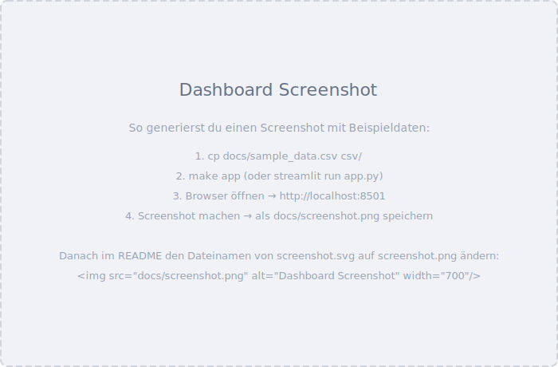

<!--

  README – DasKannBank-Graphen
  Replace <owner> in badge URLs with your GitHub username/org before publishing.

-->

<div align="center">

# DasKannBank-Graphen
  
**Ausgabenvisualisierung für DKB-Kontoauszüge**


[](https://github.com/<owner>/DasKannBank-Graphen/actions/workflows/ci.yml)
[](https://www.python.org)
[](LICENSE)
[](docs/usage.md#windows-befehle-ohne-make)
[](https://streamlit.io)
[](tests/)

<br>

<!--
  Replace with an actual screenshot once the dashboard is running.
  Example: streamlit run app.py – then take a screenshot of http://localhost:8501
-->


<br>

Pipeline to analyse DKB bank statement CSVs and visualise expenses – either as static <b>matplotlib</b> charts (PNG) or through an interactive <b>Streamlit</b> dashboard with <b>Plotly</b>.

</div>

---

## Features

- **Automatic CSV import** – reads all `csv/*.csv` files (semicolon-separated, German number format)
- **Keyword-based categorisation** – editable `categories.toml`, case-insensitive substring matching
- **Deduplication** – SHA256-based duplicate detection across multiple files
- **5 chart types** – total/yearly/monthly pie charts, monthly line chart, stacked monthly bars
- **Interactive dashboard** – Streamlit + Plotly with hover data, clickable legends, category/month filters
- **PDF converter** – `pdf2csv.py` extracts tables from DKB PDF statements via `pdfplumber`
- **Cross-platform** – Linux, macOS, and Windows

---

## Quick Start

### Linux / macOS

```bash
make install
make run         # static charts → graphs/*.png
make app         # interactive dashboard → http://localhost:8501
```

### Windows

```powershell
python -m venv .venv
.venv\Scripts\activate
pip install -r requirements.txt
python pipeline.py
streamlit run app.py
```

---

## Documentation

| Topic | Content |
|---|---|
| [Architecture](docs/architecture.md) | Data flow, modules, data model |
| [Usage](docs/usage.md) | CLI commands, dashboard, PDF conversion, tests |
| [Configuration](docs/configuration.md) | categories.toml, pipeline.toml |
| [Development](docs/development.md) | Code principles, structure, workflow |

---

## Tests

```bash
make test
```

19 unit tests covering core logic – `parse_amount`, `parse_date`, `assign_categories`, `transaction_hash`, `load_config`, `filter_expenses`.  
CI runs them on every push across Python 3.10–3.13 on Linux, macOS, and Windows.

---

## Contributing

Contributions are welcome.  

1. Open an [issue](https://github.com/<owner>/DasKannBank-Graphen/issues) to discuss changes
2. Follow the [code principles](code-principles.md)
3. Ensure all tests pass: `make test`
4. Submit a pull request

---

## License

[GNU General Public License v3.0](LICENSE)


